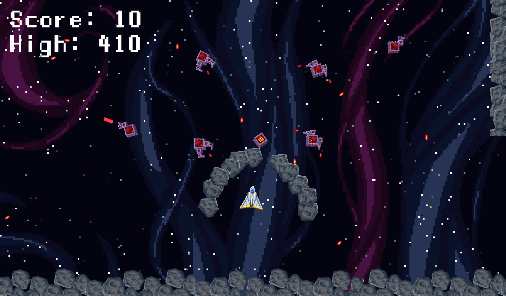
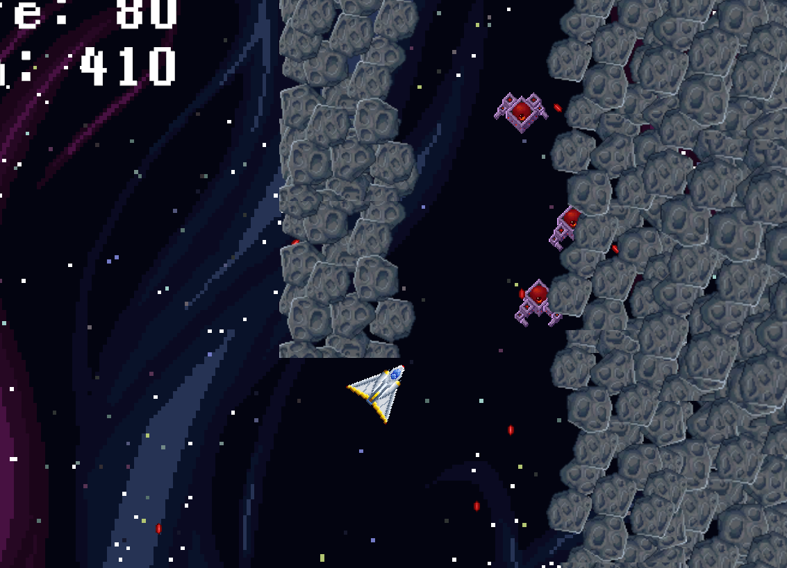
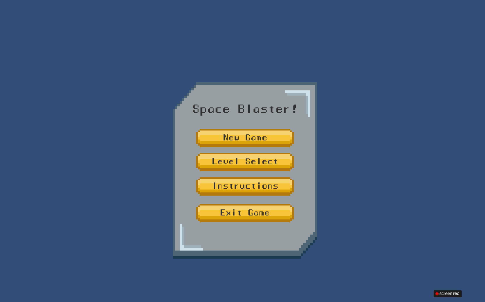

# 🔫 2D Shooter Game

<p align="center">
  
</p>

<p align="center">
<a href="YOUR_RELEASE_URL">

</a>
<a href="YOUR_LICENSE_URL">

</a>
<a href="YOUR_GITHUB_URL">

</a>
<a href="YOUR_VIDEO_URL">

</a>
</p>

<p align="center">
  <b>An action-packed 2D shooter game built with Unity.</b>
</p>

---

# 📌 About The Project

**2D Shooter Game** is a game developed by **MSK Real Labs**.

The project was created to:

* Provide an engaging and fast-paced 2D shooting experience
* Explore 2D game development and mechanics in Unity
* Build a cross-platform game for WebGL and Windows

### 🎯 Project Type

```text
Type        : Game / Action
Status      : In Development
Platform    : Windows / WebGL
Engine      : Unity
Language    : C#
Developer   : MSK Real Labs
Repository  : Public
```

---

# ✨ Features

## 🎮 Game Features

* Fast-paced 2D shooting mechanics
* Player movement and control systems
* Dynamic enemies and combat scenarios
* Health and damage systems
* Interactive UI elements

## 💻 Technical Features

* Cross-platform support (Windows & WebGL)
* Optimized 2D assets and animations
* Universal Render Pipeline (URP) configuration
* Modular scripts (Player, Enemies, Shooting, Health)

---

# 🖼️ Screenshots

## 📸 Project Gallery

The following screenshots show the project in action. (Images will be added to the `Photos/Videos` directory).

<div style="overflow-x:auto; white-space:nowrap;">

<a href="Photos/Videos/Screenshot1.png">

</a>

<a href="Photos/Videos/Screenshot2.png">

</a>

<a href="Photos/Videos/Screenshot2.png">

</a>
</div>


## ▶️ Watch The Project 🎬 Demo Video
<p align="center">
  <a href="YOUR_YOUTUBE_VIDEO_URL">
    
  </a>
</p>

> Click the Video above to watch the full demonstration.

---

# 🛠️ Built With

## 💻 Programming

* `C#`

## 🎮 Game Development

* `Unity`
* Universal Render Pipeline (URP)

## 🔧 Tools

* Git
* GitHub
* Visual Studio

---

# 🧱 Project Architecture

```text
PROJECT
│
├── Assets/
│   ├── Scripts/
│   ├── Scenes/
│   ├── Prefabs/
│   ├── Art/
│   ├── Audio/
│   └── Settings/
│
├── Photos/
│   └── Videos/
│
├── README.md
│
└── LICENSE
```

---

# 💻 System Requirements

## Minimum Requirements

| Component | Requirement                             |
| --------- | --------------------------------------- |
| OS        | Windows 10 / 11 (For Windows build)     |
| Browser   | Modern Web Browser (For WebGL build)    |
| CPU       | Intel Core i3 or equivalent             |
| RAM       | 4 GB                                    |
| GPU       | DirectX 10 compatible                   |
| Storage   | 1 GB free space                         |

---

# 📥 Download

## Option 1 — Latest Release

Download the latest tested version from:

**[⬇️ Download Latest Release](YOUR_RELEASE_URL)**

## Option 2 — Source Code

Clone the repository:

```bash
git clone YOUR_REPOSITORY_URL
```

Then:

```bash
cd Unity-2D-Shooter-Game
```

---

# 📦 Installation

## 🪟 Windows — Prebuilt Version

### Step 1 — Download

Download the latest release:

**[Download Latest Release](YOUR_RELEASE_URL)**

### Step 2 — Extract

Extract the downloaded `.zip` file.

### Step 3 — Run

Open the extracted folder and run:

```text
2DShooterGame.exe
```

## 🌐 WebGL Version

Simply open the hosted WebGL link in your browser to play the game directly without downloading.

---

# 🧰 Running From Source

## 🎮 Unity Project

### Requirements

Install:

* Unity Hub
* Git

### Unity Version

```text
Platform: Windows / WebGL
```

### Setup

Clone the repository:

```bash
git clone YOUR_REPOSITORY_URL
```

Open **Unity Hub**.

Select `Add → Add project from disk` and choose the project folder.

---

# 🎮 Controls

## Keyboard & Mouse

| Key / Input    | Action        |
| -------------- | ------------- |
| `W`, `A`, `S`, `D` | Move Player   |
| Left Click     | Shoot         |
| Mouse Movement | Aim           |

---

# 🔬 Technical Details

## Game Systems

* Player controller and physics
* Enemy AI and spawning
* Projectile instantiation and pooling
* Health management and damage calculation
* UI updates and event management

---

# 📂 Important Files

| File / Folder     | Purpose                 |
| ----------------- | ----------------------- |
| `Assets/Scripts/` | Core gameplay scripts (Player, Enemies, UI, etc.) |
| `Assets/Scenes/`  | Main game scenes        |
| `Assets/Prefabs/` | Reusable game objects (Projectiles, Enemies) |

---

# 🧪 Testing

The project has been tested on:

| Environment       | Status             |
| ----------------- | ------------------ |
| Windows 10/11     | ✅ Tested           |
| WebGL (Chrome)    | ✅ Tested           |

### Testing Areas

* [x] Game starts
* [x] Core mechanics work (Movement, Shooting)
* [x] Enemies spawn and react correctly
* [x] UI displays correct health/score

---

# 🐛 Known Issues

If you find a bug, please create a GitHub Issue.

**[🐛 Report a Bug](YOUR_ISSUES_URL)**

---

# 🗺️ Roadmap

## Version 1.0

* [x] Initial project setup
* [x] Core mechanics (Movement, Shooting)
* [x] Enemy implementation
* [x] Health and Damage system
* [x] WebGL and Windows build

---

# 🧩 Dependencies

This project uses the following external technologies/libraries:

| Dependency | Purpose        |
| ---------- | -------------- |
| Unity      | Game Engine    |
| C#         | Programming    |

---

# 🎨 Assets & Credits

## Assets Created By MSK Real Labs

* Custom scripts
* Custom 2D art (unless stated otherwise)
* UI design

---

# 📜 License

This project is licensed under the **MIT License**.

See the full license:

**[LICENSE](LICENSE)**

Copyright © 2026 **MSK Real Labs / Muhammad Shaheer Kifayat**

---

# 🔐 Project Ownership

This repository is an official project of:

**MSK Real Labs**

Developer:

**Muhammad Shaheer Kifayat**

GitHub:

**https://github.com/mskreallabs**

---

# 🤝 Contributing

Contributions are welcome. Please open an issue or submit a pull request!

---

# 💬 Feedback & Issues

Found a bug?

**[🐛 Open an Issue](YOUR_ISSUES_URL)**

Have an idea?

**[💡 Request a Feature](YOUR_FEATURE_REQUEST_URL)**

Want to discuss the project?

**[💬 Start a Discussion](YOUR_DISCUSSIONS_URL)**

---

# 📊 Project Status

<p align="center">


</p>

---

# 👨‍💻 Developer

<p align="center">


</p>

<h3 align="center">MSK Real Labs</h3>

<p align="center">
  Game Development • Software • Graphics • Web • 3D
</p>

<p align="center">

<a href="https://github.com/mskreallabs">GitHub</a> • <a href="https://mskreallabs.pages.dev/">Website</a>

</p>

---

# 🌐 More From MSK Real Labs

**Website:**
https://mskreallabs.pages.dev/

**GitHub:**
https://github.com/mskreallabs

Explore more projects, experiments, software, games, graphics work, and development projects.

---

# ⭐ Support The Project

If you found this project useful:

* ⭐ Star the repository
* 👀 Follow `mskreallabs`
* 🐛 Report bugs
* 💡 Suggest improvements
* 🤝 Contribute
* 📢 Share the project

---

<p align="center">

</p>
